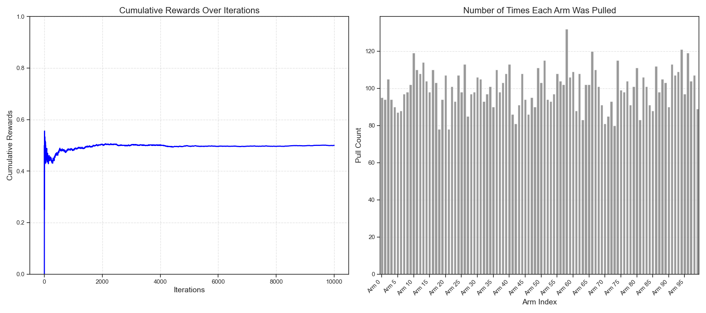
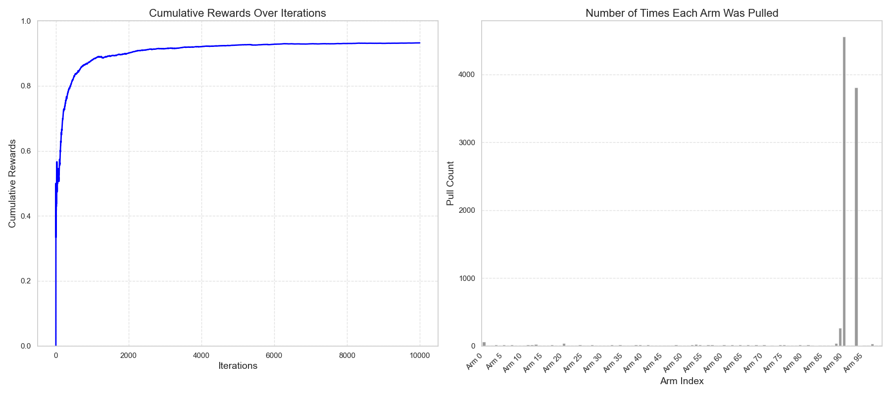

# Multi-Armed Bandit Agents

This repository contains implementations of various algorithms to solve the Multi-Armed Bandit (MAB) problem. These algorithms address the trade-off between exploration and exploitation in decision-making processes. The agents are evaluated using a simulated environment with visualized performance metrics.

## Features

- **Random Policy**: Selects arms randomly as a baseline approach.
- **Greedy Agent**: Always selects the arm with the highest observed reward.
- **Epsilon-Greedy Agent**: Balances exploration and exploitation by selecting a random arm with probability `epsilon`.
- **Upper Confidence Bound (UCB)**: Systematically explores under-sampled arms based on confidence intervals.
- **Softmax Exploration**: Chooses arms probabilistically based on exponential weighting of estimated values.

## Repository Structure

```plaintext
.
├── environment.py         # Bandit environment definition
├── epsilon_greedy_agent.py # Epsilon-Greedy agent implementation
├── greedy_agent.py         # Greedy agent implementation
├── random_agent.py         # Random agent implementation
├── softmax_exploration.py  # Softmax exploration agent implementation
├── main.py                 # Main script to evaluate and compare agents
├── test.py                 # Unit tests and debug scripts

```
## How to Run

1. **Clone the repository**:
    ```bash
    git clone https://github.com/yourusername/multi-armed-bandit-agents.git
    cd multi-armed-bandit-agents
    ```

2. **Install Dependencies**:
    Ensure you have Python 3.7+ and install the required packages:
    ```bash
    pip install numpy matplotlib seaborn
    ```

3. **Run the Main Script**:
    Compare the performance of Epsilon-Greedy and UCB agents:
    ```bash
    python main.py
    ```

4. **Test Individual Agents**:
    Test specific agents using their respective scripts, such as:
    ```bash
    python test.py
    ```

## Algorithms

### 1. Random Policy
A baseline strategy that selects an arm at random without learning from past actions.

- **File**: `random_agent.py`
- **Key Features**:
  - No learning mechanism.
  - Uniform exploration of all arms.

### 2. Greedy Agent
Exploits the arm with the highest observed average reward.

- **File**: `greedy_agent.py`
- **Key Features**:
  - Exploitation-focused strategy.
  - Risk of converging to suboptimal arms due to lack of exploration.

### 3. Epsilon-Greedy Agent
Balances exploration and exploitation by using a probabilistic approach.

- **File**: `epsilon_greedy_agent.py`
- **Key Features**:
  - `epsilon`: Probability of exploring a random arm.
  - Converges to high-performing arms over time.

### 4. Upper Confidence Bound (UCB)
Systematically explores under-sampled arms using a confidence interval approach.

- **File**: `main.py` (UCB implemented inline)
- **Key Features**:
  - Balances exploration and exploitation.
  - Robust in uncertain environments.

### 5. Softmax Exploration
Selects arms probabilistically based on their estimated values.

- **File**: `softmax_exploration.py`
- **Key Features**:
  - Temperature parameter (`tau`) controls exploration intensity.
  - Exponentially weights arm values.

## Results

The performance of Epsilon-Greedy and UCB algorithms was evaluated using:
- **Cumulative Rewards**: Measures total reward accumulated over iterations.
- **Arm Selection Behavior**: Tracks how often each arm is selected.

Key Observations:
- **Epsilon-Greedy** converges quickly but may neglect underexplored arms.
- **UCB** balances exploration and exploitation, ensuring robustness in uncertain environments.

## Sample Output


### Number of Times Each Arm Was Pulled
- **Random**
  
- **Epsilon-Greedy**
  
- **UCB**
  

## Future Enhancements

- Add support for non-stationary bandit problems.
- Implement Bayesian approaches like Thompson Sampling.
- Explore contextual bandits for real-world applications.

## License

This project is licensed under the MIT License. See the [LICENSE](LICENSE) file for details.

## Contributing

Contributions are welcome! Please fork this repository, create a feature branch, and submit a pull request.

---

Happy coding!
